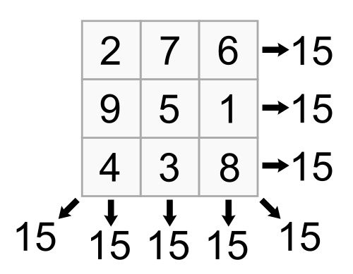

# 1.Magic Squares

A magic square is a square grid of usually positive natural numbers whose sums of the numbers in each row, column, and diagonals are the same.  
Here are a few examples,

# 2.Magic square of squares
A magic square is a magic square of square if the numbers in each cell can be squared and the resulting grid is also a magic square.

